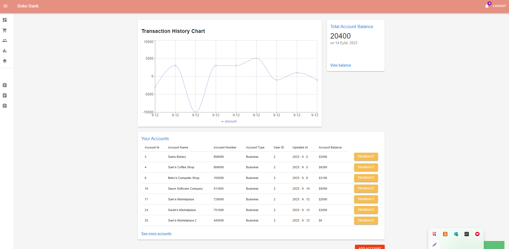
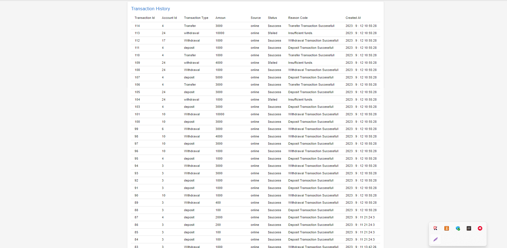

Users can register, log in, view their account history, open new accounts, make transfers between accounts, deposit money, withdraw money, and make payments. Additionally, a self-updating chart has been prepared for users to view their account flows. In short, the components are constantly in communication with the backend, ensuring seamless interaction.

## Project Images and Components

